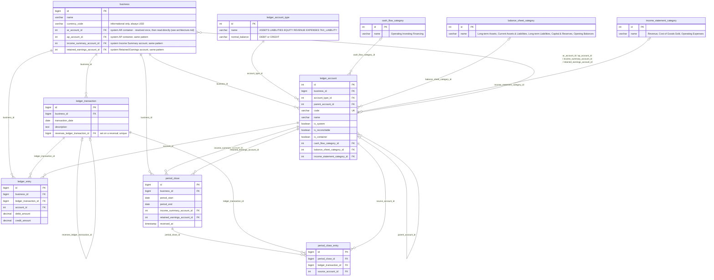
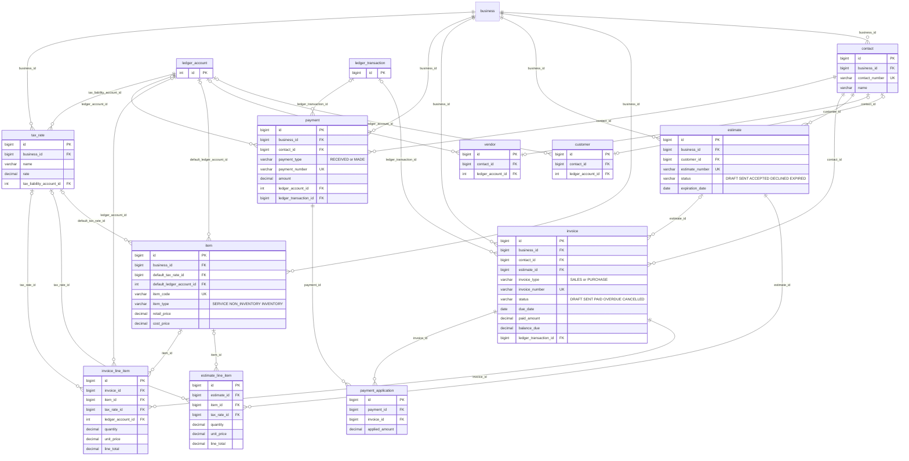
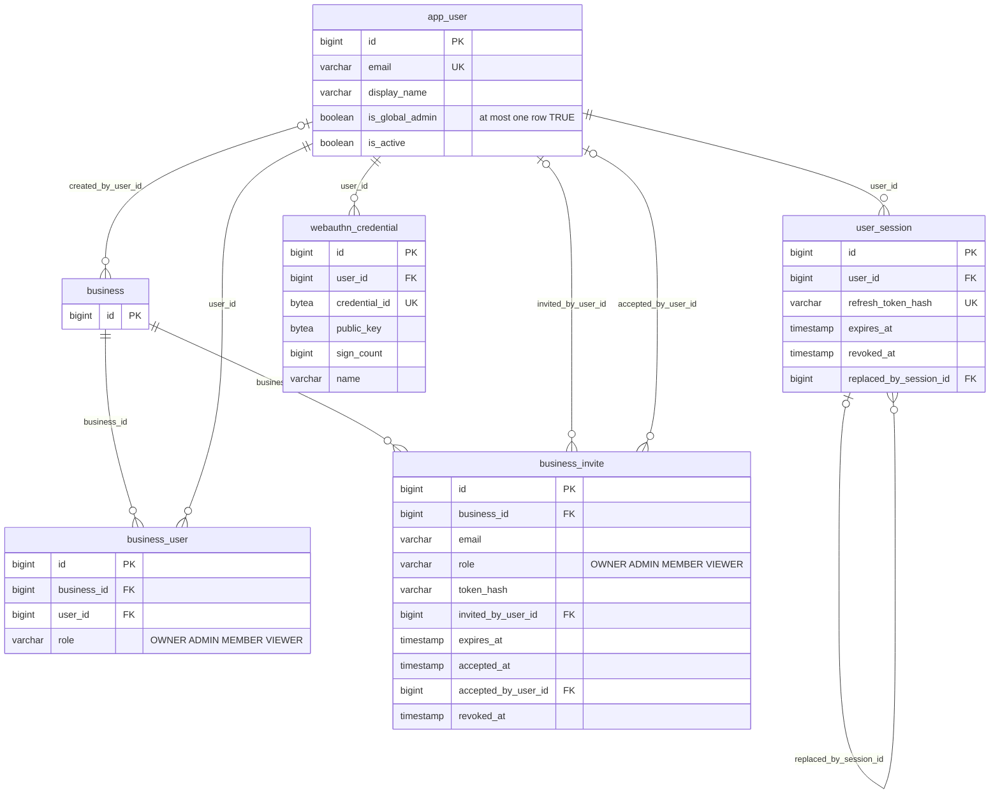
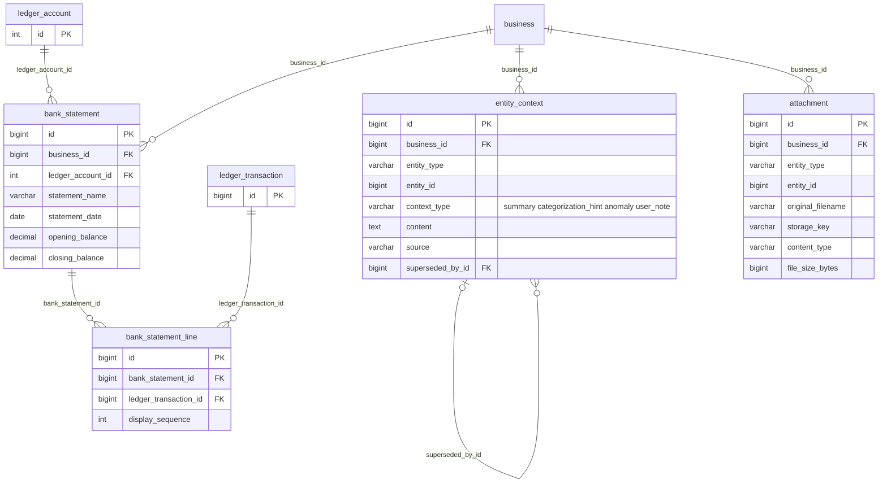

# Denarix Schema Reference

An entity-relationship reference for the `denarix` accounting schema defined in
[`migrations/00001_initial.up.sql`](../migrations/00001_initial.up.sql) — the double-entry
ledger at its core, the parties and trading documents built on top of it, and the banking, tax,
and AI-context tables that extend it.

Split into four diagrams by domain. A single-attribute box with just `id PK` is a **stub** —
its full definition lives in another diagram, included only to show the relationship.

> Regenerate this file (and the companion [styled schema artifact](https://claude.ai/code/artifact/2b23ae71-ba76-4d55-baec-91bf02304623))
> after schema changes rather than hand-editing it out of sync. The artifact is generated
> straight from the migration — every table, column, FK, unique index and CHECK enum — so it
> can't drift the way hand-written prose can; the diagrams and the design notes in it come
> from this file.

## 1. Core Ledger & Chart of Accounts

The double-entry spine everything else posts against, plus the account tree and classification
tables that shape it.

- **`ledger_account_type`** — a fixed six-row enum (ASSETS, LIABILITIES, EQUITY, REVENUE,
  EXPENSES, TAX_LIABILITY), seeded once. `normal_balance` drives which side (debit or credit) is
  the "natural" positive direction for display.
- **`ledger_account`** — the chart of accounts. `parent_account_id` self-references for a tree;
  `is_system` protects default accounts from deletion or rename; `is_container` marks a
  non-postable "roll-up" node (e.g. a business's single "Accounts Receivable"/"Accounts Payable"
  account, under which every customer's/vendor's own sub-ledger account is filed as a child - see
  `customer`/`vendor` in diagram 2 - so the balance sheet shows one AR/AP total instead of one
  line per customer); `is_reconcilable` flags which accounts (bank, cash) are eligible for
  statement import. `id` is a real identity column (unlike
  `ledger_account_type`/`cash_flow_category`/`balance_sheet_category`/`income_statement_category`,
  plain `INTEGER PRIMARY KEY` since they're fixed, migration-seeded enums the app never inserts
  into) so the API can create accounts — e.g. period-close's Income Summary/Retained Earnings
  provisioning — without hand-rolling ID allocation.
- **`ledger_transaction` + `ledger_entry`** — the double-entry split: `ledger_transaction` is the
  shared event (date, description, reference); `ledger_entry` is each individual debit or credit
  posting under it. A CHECK constraint enforces exactly one side populated per entry, so
  `SUM(debit) = SUM(credit)` is a checkable property of the data, not just a hope.
  `reverses_ledger_transaction_id` is set on a reversing transaction (every reversal goes through
  `internal/ledgerpost.ReverseTransaction`) to the transaction it mirrors; a partial unique index
  on it means a transaction can be reversed at most once, and lets `ReverseLedgerTransaction`
  refuse to reverse a reversal. See `docs/architecture.md`, "Corrections model".
- **`currency_code`** — single-currency for now. `business.currency_code` is informational only
  (no `currency`/`exchange_rate` tables, no per-account or per-entry currency tracking).
  Everything is assumed USD; multi-currency was designed once already and deliberately stripped
  back out to keep the ledger simple until there's a real need for it.
- **`cash_flow_category`** — Operating / Investing / Financing classification for cash-flow
  statements. Kept separate from `ledger_account_type` because balance-sheet placement is
  already derivable from account type + normal balance, but cash-flow placement is not.
- **`balance_sheet_category`** — presentation-only grouping for the balance sheet report (Long-term
  Assets, Current Assets & Liabilities, Long-term Liabilities, Capital & Reserves, Opening
  Balances), computed by `internal/reporting.BalanceSheet`. Independent of `ledger_account_type`
  for the same reason as `cash_flow_category`: nothing about an ASSETS account says whether it's
  a *current* or *long-term* one (a bank account and a laptop are both ASSETS) — that's a
  judgment call this table captures instead. Which column a line prints in (Asset vs. Liability)
  still comes from `normal_balance`, not this table — a category like "Current Assets &
  Liabilities" deliberately mixes both.
- **`income_statement_category`** — presentation-only grouping for the income statement report
  (Revenue, Cost of Goods Sold, Operating Expenses), only meaningful for REVENUE/EXPENSES-type
  accounts. Splitting EXPENSES into Cost of Goods Sold vs. Operating Expenses is what makes Gross
  Profit (Revenue − COGS) — the standard first subtotal on a US multi-step income statement —
  computable. Identified by row (id/name), the same as `balance_sheet_category`, rather than a
  boolean flag on `ledger_account`; `balance_sheet_category_id` and `income_statement_category_id`
  are meant to be mutually exclusive per account (a discriminated pair — `account_type_id`
  decides which one applies), computed by `internal/reporting.IncomeStatement`.
- **`period_close` + `period_close_entry`** — end-of-period consolidation. Closing sweeps every
  REVENUE/EXPENSE account into a per-business Income Summary `ledger_account`, then Income
  Summary into Retained Earnings — two ordinary `is_system` EQUITY accounts, so the closing
  postings are indistinguishable from any other `ledger_transaction`/`ledger_entry` pair.
  `period_close_entry` links each generated transaction back to the account it zeroed, so a close
  can be located or reversed (`reversed_at`) without pattern-matching on description text. A
  trigger (`enforce_period_lock`) hard-locks a business through the latest unreversed
  `period_end`: any `ledger_transaction`/`ledger_entry` insert or edit dated on or before that
  date is rejected, except a close's own postings, which land *before* its `period_close` row is
  inserted and so predate the lock they create.

## 2. Parties & Trading Documents

Who you do business with, and the estimates, invoices, and payments that flow between you —
generalized to carry both accounts-receivable and accounts-payable activity.

`ledger_account` is a stub here — full definition in diagram 1.

- **`contact`** — generalized "customer": which role(s) a party plays is identified by row
  existence in `customer`/`vendor` (0, 1, or both), not a boolean on `contact` itself - the same
  row-identity pattern as `balance_sheet_category`/`income_statement_category` rather than a flag.
- **`customer` / `vendor`** — one optional row per contact per role. `ledger_account_id` is that
  role's own AR/AP sub-ledger account (`ledger_account.parent_account_id` rolls it up under a
  business's single "Accounts Receivable"/"Accounts Payable" container account - see diagram 1).
  A contact that's both a customer and a vendor (e.g. a supplier you also sell to) gets one row in
  each table, with independent AR and AP sub-accounts, auto-created at contact creation time
  (`internal/server/system_accounts.go`) rather than something the caller points at an existing
  account - there's no request field for one. A sub-account is given the same
  `balance_sheet_category_id` as its container ("Current Assets & Liabilities"), though that's
  redundant rather than load-bearing: `internal/reporting.BalanceSheet` sums a container and every
  descendant into one line driven purely by `parent_account_id` (not `is_container`, which is
  documentation/UI intent rather than what the rollup actually keys on), so a child's own category
  is never read for that report.
- **`estimate`** — deliberately *not* unified with `invoice`. It has no ledger impact — nothing
  is owed until it converts — and its lifecycle genuinely differs: DRAFT → SENT → ACCEPTED /
  DECLINED / EXPIRED, with `expiration_date` rather than a payment `due_date`, and no
  `paid_amount` or `balance_due` at all.
- **`invoice`** — generalized across AR and AP via `invoice_type` rather than split into a
  separate `bill` table — a sales invoice and a vendor bill are the *same kind* of event (real
  ledger impact, same status lifecycle, same due-date/paid-amount shape), unlike estimate.
  `contact_id` resolves to a customer or vendor depending on type. `ledger_transaction_id` links
  back to the GL posting this invoice produced — required to be set as of CreateInvoice, since
  every line item's `ledger_account_id` and the contact's own customer/vendor `ledger_account_id`
  (whichever `invoice_type` selects) are both mandatory (see below). `estimate_id` links an
  invoice back to the estimate it came from; `CreateInvoice` can also build the invoice's line
  items *from* that estimate — pass `estimate_id` with `line_items` empty and each estimate line's
  `item_id`/`description`/`quantity`/`unit_price`/`is_taxable`/`tax_rate_id` carries over as-is,
  with `ledger_account_id` resolved fresh through `resolveInvoiceLines` (estimate lines have no
  ledger account of their own — see below).
- **`invoice_line_item.item_id` / `estimate_line_item.item_id`** — every line references a
  catalog `item` from the document's own business; there are no free-text lines (Xero/QuickBooks
  style). This is enforced by the API (`lookupLineItem` in `internal/server/trading_service.go`:
  missing → `INVALID_ARGUMENT`, another business's item → `INVALID_ARGUMENT`, inactive item →
  `FAILED_PRECONDITION`) and the CLI (`--line` requires `item=<id>`), **not** by the schema —
  the columns stay nullable because rows created before the catalog existed have `NULL` here.
  Those legacy rows are read-only history: they still render and report fine, but
  `update-lines` on such a document has to re-point every line at a real item.
- **`invoice_line_item.ledger_account_id`** — which revenue (SALES) or expense (PURCHASE)
  account this line posts to. It is *always* the line's item's `default_ledger_account_id`,
  snapshotted onto the line at posting time by `resolveInvoiceLine` — a later change to the
  item's account doesn't rewrite already-posted invoices, and there is no per-line override
  (`NewInvoiceLineItem` has no such field; the old one is `reserved`). An item with no
  `default_ledger_account_id` is rejected with `FAILED_PRECONDITION` rather than producing an
  unpostable line — and `CreateItem` requires the field, so only pre-catalog items can lack it.
  The other item-derived fields are defaults, not enforcement: `description` falls back to
  `item.name`, and `unit_price`/`is_taxable`/`tax_rate_id` to the item's
  `retail_price`/`is_taxable`/`default_tax_rate_id`, each overridable per line. The invoice's
  contact must also have a `customer` (for SALES) or `vendor` (for PURCHASE) row with its own
  `ledger_account_id` set — an invoice posts atomically at creation, always.
  `UpdateInvoiceLineItems` regenerates the linked ledger transaction's entries in place (same
  `ledger_transaction_id`, entries replaced) when a posted invoice's lines change, rather than
  rejecting the edit — see `docs/architecture.md`, "Corrections model". One consequence of that:
  the snapshot is re-taken every time a line's account is resolved, not just once. Changing an
  item's `default_ledger_account_id` never rewrites an *untouched* historical invoice — but calling
  `UpdateInvoiceLineItems` on an old invoice **after** changing the item's default moves that
  invoice's line (and its posted entries) to the new account, same as any other invoice created
  after the change. The snapshot protects against silent rewrites, not against a deliberate re-edit.
- **Discounts are a negative line against a catalog item, not a header field.** A line's
  `quantity`/`unit_price`/`line_subtotal`/`line_total` carry no CHECK constraints, so a negative
  amount is representable end to end: `writeInvoiceLedgerEntries`'s `debitCreditFor` maps a
  negative line onto the *opposite* side of `ledger_entry`'s required debit/credit split
  (`ledger_entry_debit_or_credit`) at that same item's `default_ledger_account_id` — e.g. a
  −$100 line against a "Discount" item posts as a $100 *debit* to that item's own account, a
  standard contra-revenue/contra-expense posting, no separate discount machinery needed. The
  item is what answers the allocation question a header `discount_amount` column never could:
  which account absorbs it, decided once at item-creation time rather than per-invoice. A
  document's *total* may not go negative, though — `computeLines` rejects that, since nothing
  downstream (payments, `balance_due`, `invoice.status`) models a credit note.
- **`payment`** — generalized via `payment_type` (RECEIVED / MADE). Applying it to an invoice is
  independent of the payment itself: zero, one, or several `payment_application` rows (each with
  its own `applied_amount`) let one deposit cover several invoices at once, rather than the
  one-payment-one-invoice limit a single nullable `invoice_id` would impose. `ledger_account_id`
  is the cash/bank account a posted payment hit (the other side of the contact's customer/vendor
  AR/AP account, selected by `payment_type`); `ledger_transaction_id` links back to that posting,
  same nullable-until-posted convention as `invoice`.
- **`payment_application`** — join table between `payment` and `invoice`; `applied_amount` is
  how much of the payment went to that invoice specifically. The sum across one payment's
  applications can't exceed its `amount` (a payment may be partially or fully unapplied, never
  over-applied).
- **`item`** — the sales/purchase catalog (formerly `service`): anything that can appear as a
  line on an estimate or invoice. `item_type` says how the business treats it — `SERVICE`
  (labour/time, nothing physical), `NON_INVENTORY` (a physical product that's sold or bought but
  whose stock isn't tracked — drop-shipped, consumables, one-offs) or `INVENTORY` (a physical
  product whose on-hand quantity the business wants tracked). Only the classification exists so
  far: an `INVENTORY` item carries no quantity, inventory-asset account or COGS behaviour yet;
  that lands alongside stock movements. It's a `VARCHAR` + `CHECK` string enum like
  `invoice_type`, not a boolean pair, since more modes are expected.
  Every estimate/invoice line must reference an item (see the `item_id` bullet above), so the
  catalog is the only way anything gets onto a document. `default_ledger_account_id` is
  required by `CreateItem` and is *the* account every invoice line for the item posts to — not
  overridable per line (see `invoice_line_item.ledger_account_id`). `name`, `retail_price`,
  `is_taxable` and `default_tax_rate_id` are genuine defaults: `resolveEstimateLine` /
  `resolveInvoiceLine` fill a line's `description`/`unit_price`/`is_taxable`/`tax_rate_id` from
  them when the line leaves those unset, and an explicit value on the line always wins.
  Deactivating an item (`is_active = FALSE`) keeps it on existing lines but stops it going on
  new ones.
- **`tax_rate`** — a named rate (e.g. "Standard 20%") tied to its own liability account.
  `item.default_tax_rate_id` and each line item's `tax_rate_id` reference it (`ledger_account`
  has no default-tax-rate column — dropped as redundant with `item.default_tax_rate_id`, the
  more common day-to-day entry path). A line item's own `tax_rate` / `tax_amount` columns still
  snapshot the rate actually applied at the time, so a later change to `tax_rate` never rewrites
  history — `item.default_tax_rate_id` doesn't need that same snapshot, since an item is
  catalog data, not a historical transaction. A line's `tax_rate_id` is resolved through
  `GetTaxRateInBusiness`, the same tenancy gate `GetItemInBusiness` applies to `item_id` — a line
  can't reference another business's tax rate (and post to that business's liability account).
  `GetTaxRate` itself stays unscoped, used only where a `tax_rate_id` is being read back off an
  already-stored, already-vetted line (e.g. the tax breakdown on a rendered PDF).

## 3. Users & Auth

Application users (authenticated via passkeys/WebAuthn) and the businesses
they can access.

`business` is a stub here — full definition in diagram 1.

- **`app_user`** — authenticated via passkeys (WebAuthn), not a third-party
  OAuth identity provider — no Apple Developer portal setup, and an
  iPhone/Mac passkey backed by iCloud Keychain works through the same
  standard flow, so Apple-device users are covered without a separate
  integration. `email` is the human-facing identifier: used for account
  lookup/display and as the WebAuthn `user.name` during passkey
  registration. The actual credential material lives in
  `webauthn_credential`, never here.
- **`is_global_admin`** — the one cross-business privilege in the schema:
  only a global admin can create a business (`BusinessService.CreateBusiness`,
  `auth.RequireGlobalAdmin`) or invite/manage users on any business. There
  can be **at most one** at a time, enforced in the DB rather than only in
  application code, by a unique index on a constant expression with a
  partial `WHERE is_global_admin = TRUE AND deleted_at IS NULL`.
  `UserService.SetGlobalAdmin` transfers the flag (clear the old holder, set
  the new one, in one transaction) so it never attempts to violate that; the
  very first admin has nobody to grant it, so it's bootstrapped from
  `DENARIX_BOOTSTRAP_ADMIN_EMAIL` at startup (`internal/auth/bootstrap.go`).
- **`webauthn_credential`** — one row per registered passkey (a user may
  register more than one, e.g. a laptop and a phone). `credential_id`/
  `public_key` are the raw values a WebAuthn relying-party library produces;
  `sign_count` backs its clone-detection check. Cross-device sign-in (scan a
  QR code from your phone) is handled natively by the browser's built-in
  passkey UI — nothing here or in the API implements that transport.
- **`business_user`** — membership + role join table; a user can belong to
  multiple businesses, a business can have multiple users. `role` is a
  `VARCHAR` + `CHECK`, matching the schema's existing string-enum convention
  (`invoice.status`, `payment.payment_type`, ...) rather than a native
  Postgres enum type.
- **`business_invite`** — a pending invitation to join a business, carrying
  the `role` the invitee will get once they accept. `token_hash` stores a
  digest of the invite token, never the raw value (same rule as
  `user_session.refresh_token_hash`), and the row is the audit trail as much
  as the pending state: `expires_at`/`revoked_at`/`accepted_at` +
  `accepted_by_user_id` mean an accepted or withdrawn invite stays on record
  rather than being deleted. `email` is the invited address, which is
  deliberately *not* an FK — you can invite someone who has no `app_user`
  row yet, and the link to a real user is only made at acceptance.
- **`user_session`** — server-side refresh-token storage for dxctl/API
  sessions. Access tokens are short-lived signed JWTs, verified in-process on
  every gRPC call with no DB hit; only the long-lived refresh token here is
  server-side and revocable (`refresh_token_hash` stores a digest, never the
  raw token). `replaced_by_session_id` tracks rotation.
- **`created_by_user_id`** — a nullable FK to `app_user`, added to header/
  parent tables across the schema (`business`, `ledger_account`,
  `ledger_transaction`, `period_close`, `contact`, `item`, `tax_rate`,
  `estimate`, `invoice`, `payment`, `bank_statement`, `entity_context`,
  `attachment`) so records can be attributed to the user who created them,
  not just scoped to a business. Stays nullable everywhere — period-close
  postings and any future legacy import have no acting user. Child rows
  (line items, `ledger_entry`, `period_close_entry`,
  `bank_statement_line`, `payment_application`) don't get their own column;
  they inherit attribution from their parent.

## 4. Banking, AI Context & Attachments

Reconciliation against real bank statements, and two polymorphic tables that hang supplementary
material off any record elsewhere in the schema.

`ledger_account` and `ledger_transaction` are stubs — full definitions in diagram 1.
`entity_type` / `entity_id` on the bottom two tables are deliberately **not** drawn as
relationships — see note below.

- **`bank_statement` + `bank_statement_line`** — a statement belongs to one `is_reconcilable`
  ledger account; each line links one cleared `ledger_transaction` to it, with a unique
  constraint on the pair so nothing reconciles twice.
- **`entity_context`** — polymorphic store for AI-generated context (summaries, categorization
  hints, anomaly flags, notes) tied to any record elsewhere in the schema, so a future Claude
  Code session can retrieve prior context about whatever it's working on. `entity_type` +
  `entity_id` deliberately carry **no database-level foreign key**, since they span many
  possible target tables. `superseded_by_id` lets a batch of old rows roll up into one new
  summary without deleting the trail.
- **`attachment`** — same polymorphic pattern, for files. `storage_key` is an object key in an
  internal object-storage backend (SeaweedFS locally, S3-compatible — see
  `internal/storage`, `docker-compose.yml`), not a URL, and is never exposed through the API:
  `AttachmentService.UploadAttachment`/`DownloadAttachment` (`proto/denarix/v1/context.proto`) stream
  a file's bytes through gRPC itself, gated by the same `RequireBusinessRole` auth check as every
  other resource, rather than exposing public, unauthenticated attachment URLs.

## Patterns worth carrying forward

- **Generalize with a discriminator** when two things are the *same kind* of event —
  `invoice.invoice_type`, `payment.payment_type`. Keep tables separate when they're fundamentally
  different events, even if the shape looks similar — `estimate` vs `invoice`.
- **Row existence over a boolean flag** when the thing being flagged carries its own data, not
  just a bit. `customer`/`vendor` (a contact's role, plus that role's own `ledger_account_id`) and
  `income_statement_category`/`balance_sheet_category` (an account's classification, plus its
  report-section metadata) both use this - a plain boolean (`contact.is_customer`, the old
  `ledger_account.is_cost_of_goods_sold`) has nowhere to hang that extra data.
- **FK naming tracks generalization.** A column stays role-specific (`estimate.customer_id`)
  until its table is actually generalized, at which point it becomes generic
  (`invoice.contact_id`).
- **Snapshot, don't reference, at the point of sale.** Line items store their own `unit_price`
  and `tax_rate` rather than only a pointer to `item` / `tax_rate`, so a later catalog or
  rate change never silently rewrites a historical document.
- **The catalog item is the allocation decision.** A header-level `discount_amount` column has
  no way to say *which account* absorbs a discount; a discount modelled as a line against a
  catalog item does, via that item's own `default_ledger_account_id` — set once, at
  item-creation time, the same way every other line's revenue/expense account is decided. This
  is why `discount_amount` could be deleted outright rather than ever implemented (see
  `invoice_line_item.ledger_account_id` above).
- **Optimistic concurrency via `resource_version`** (Kubernetes' `resourceVersion`, as a
  per-row `BIGINT`). Every mutable resource (`business`, `ledger_account`, `contact`, `item`,
  `tax_rate`, `estimate`, `invoice`) carries one; the `bump_resource_version` trigger increments
  it on *every* UPDATE to the row - user edits, soft-deletes, and internal side effects like
  `ConsumeNextInvoiceNumber` or `ApplyPaymentToInvoice` alike - so it can't be set from outside
  and strictly tracks committed writes. The API returns it on every read and takes it back as an
  optional precondition on every `Update*`/`Deactivate*` RPC: the query adds
  `AND resource_version = $expected`, so the check is atomic with the write (no read-then-write
  window), and a stale caller gets `ABORTED` with nothing changed - re-read, reapply, retry.
  Unset (0) is unconditional, as in k8s. For multi-statement updates (`UpdateInvoiceLineItems`,
  `UpdateEstimateLineItems`) only the *first* statement to touch the parent row carries the
  check; it also takes the row lock everything after it runs under, so the rest of the
  transaction stays unconditional. One consequence to know about: `business.next_invoice_number`
  lives on the business row, so creating an invoice bumps the *business's* version - a
  conditional `UpdateBusiness` racing an invoice creation will conflict even though the fields
  it edits didn't change. That's the row-granularity model working as designed, not a bug; if it
  ever chafes, move the counters to their own table rather than exempting them from the trigger.

## Not yet built

- No `purchase_order` — the AP-side equivalent of `estimate`.
- Semantic search over `entity_context` (pgvector) — deferred until a real retrieval need exists.
- Multi-currency — built once (`currency`, `exchange_rate`, per-entry FX), then removed while
  everything stays USD-only.
- No fiscal-year-end setting on `business` and no scheduler — closes must be triggered
  explicitly; nothing auto-closes on a recurring date.
- PURCHASE-side tax is rolled into the expense line rather than split to a liability account
  (`tax_liability_account_id` models tax *collected*, which fits SALES, not tax paid to a
  vendor) — a deliberate simplification, not an oversight.
- No API surface to change an existing `customer`/`vendor` row's `ledger_account_id`, or to add a
  role to a contact that doesn't already have one — only `CreateContact` provisions them, via its
  `is_customer`/`is_vendor` intent flags.
